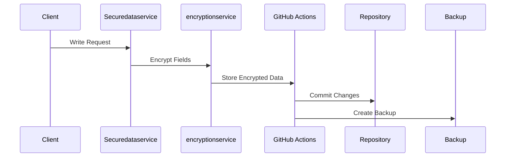
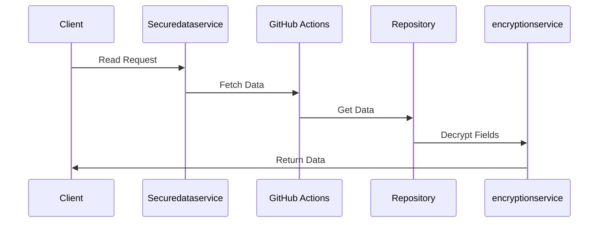

# Security Implementation Documentation

## Overview

This document describes how security is implemented in the Assiduous Realty platform, which runs on GitHub Pages with a JSON-based data store.

## Architecture

```
┌─────────────────────────────────────────────────────┐
│                   GitHub Pages                       │
│                                                     │
│   ┌─────────────┐        ┌──────────────────┐      │
│   │   Static    │        │    Client-side    │      │
│   │   Assets    │        │   Application     │      │
│   └─────────────┘        └──────────────────┘      │
│          │                        │                 │
│          │                        ▼                 │
│          │               ┌──────────────────┐      │
│          │               │  Secure Service   │      │
│          │               │     Layer        │      │
│          │               └──────────────────┘      │
│          │                        │                 │
└──────────┼────────────────────────┼────────────────┘
           │                        │
           ▼                        ▼
    ┌─────────────┐        ┌──────────────────┐
    │   GitHub    │        │  GitHub Actions   │
    │ Repository  │        │    Workflow      │
    └─────────────┘        └──────────────────┘
           │                        │
           │                        ▼
    ┌─────────────┐        ┌──────────────────┐
    │  Protected  │        │  GitHub Secrets   │
    │    Data     │        │   & Variables     │
    └─────────────┘        └──────────────────┘
```

## Components

### 1. Data Storage
- Public Data: Stored in repository as JSON files
- Sensitive Data: Encrypted before storage
- Location: `/data/` directory
- Protected by: `.gitignore` and encryption

### 2. Security Services

#### encryptionservice
```javascript
// src/services/encryptionservice.js
class encryptionservice {
  // Uses AES-256-GCM encryption
  // Key stored in GitHub Secrets
  // Handles field-level encryption
}
```

#### Securedataservice
```javascript
// src/services/Securedataservice.js
class Securedataservice {
  // Wraps dataservice with encryption
  // Automatically handles sensitive fields
  // Manages secure offline storage
}
```

### 3. GitHub Actions Workflow
```yaml
# .github/workflows/database.yml
name: Secure Database Operations
env:
  DATABASE_ENCRYPTION_KEY: ${{ secrets.DATABASE_ENCRYPTION_KEY }}
  JWT_SECRET: ${{ secrets.JWT_SECRET }}
```

## Data Flow

### Writing Data
1. Client makes write request
2. Securedataservice encrypts sensitive fields
3. GitHub Action validates request
4. Data stored in repository
5. Backup created automatically



### Reading Data
1. Client makes read request
2. GitHub Action retrieves data
3. Securedataservice decrypts sensitive fields
4. Decrypted data returned to client



## Security Measures

### 1. Encryption
- Algorithm: AES-256-GCM
- Key Management: GitHub Secrets
- Field-Level Encryption
- Secure Key Rotation Support

### 2. Access Controls
```javascript
// Sensitive field definitions
const SENSITIVE_FIELDS = {
  users: ['email', 'phone', 'password'],
  properties: ['owner.contactInfo'],
  transactions: ['financialDetails']
};
```

### 3. GitHub Security
- Protected Branches
- Required Reviews
- Secret Scanning
- Dependency Analysis

## Implementation Guide

### 1. Setup GitHub Secrets
```bash
# Add required secrets in GitHub repository settings
DATABASE_ENCRYPTION_KEY=<generated-key>
JWT_SECRET=<generated-secret>
```

### 2. Using Secure Services
```javascript
// Example usage in components
import { securedataservice } from '../services/Securedataservice';

// Create user (automatically encrypts sensitive fields)
const user = await securedataservice.create('users', {
  name: 'John Doe',
  email: 'john@example.com'  // Will be encrypted
});

// Read user (automatically decrypts)
const users = await securedataservice.find('users', {
  name: 'John Doe'
});
```

### 3. Handling Offline Data
```javascript
// Offline operations are automatically encrypted
securedataservice.queueOfflineOperation(
  'create',
  'users',
  null,
  userData
);

// Sync when online
await securedataservice.syncOfflineData();
```

## Limitations

1. GitHub Pages Constraints
   - Static hosting only
   - No server-side processing
   - Limited by GitHub Actions quotas

2. Security Considerations
   - Client-side encryption
   - Rate limiting required
   - Backup management needed

## Migration Path

### To MongoDB
```javascript
// Generate migration script
const script = await databaseUtils.generateMongoMigration();

// Includes:
// - Collection creation
// - Index setup
// - Data migration
// - Security configuration
```

### To Other Platforms
- Data structure preserved
- Encryption remains compatible
- Access controls transferable

## Testing Security

### 1. Encryption Tests
```javascript
describe('encryptionservice', () => {
  it('should encrypt sensitive fields', async () => {
    // Test encryption
  });
  
  it('should decrypt sensitive fields', async () => {
    // Test decryption
  });
});
```

### 2. Access Control Tests
```javascript
describe('Securedataservice', () => {
  it('should handle permissions', async () => {
    // Test access controls
  });
  
  it('should validate requests', async () => {
    // Test validation
  });
});
```

## Best Practices

1. Data Protection
   - Never store unencrypted sensitive data
   - Use environment-specific keys
   - Regular security audits

2. Error Handling
   - Secure error messages
   - Fail-safe defaults
   - Audit logging

3. Key Management
   - Regular key rotation
   - Secure key storage
   - Backup key management

## Support

### 1. Troubleshooting
- Check encryption status
- Verify GitHub Secrets
- Monitor Action logs

### 2. Maintenance
- Regular backups
- Key rotation
- Security updates

## Future Enhancements

1. Planned Features
   - Two-factor authentication
   - Enhanced audit logging
   - Advanced encryption options

2. Scalability
   - Improved caching
   - Better offline support
   - Enhanced sync mechanisms
