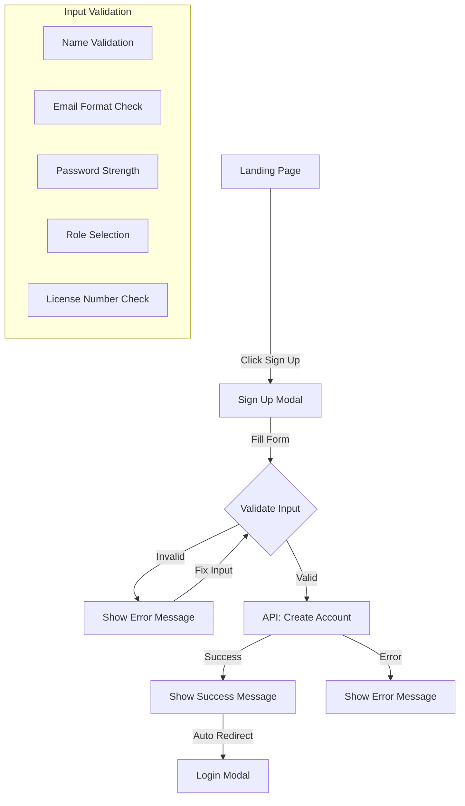
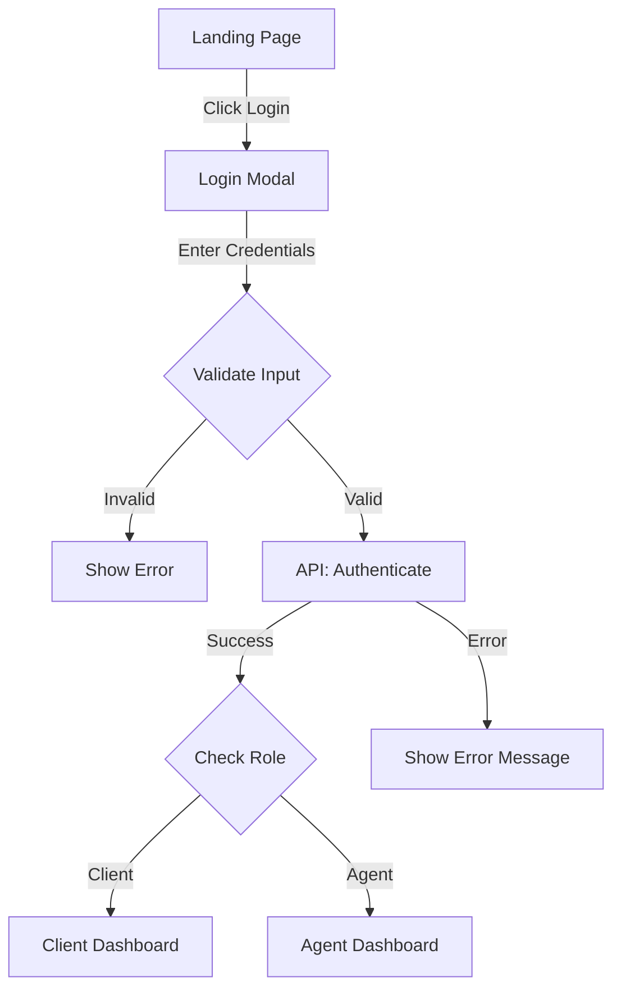
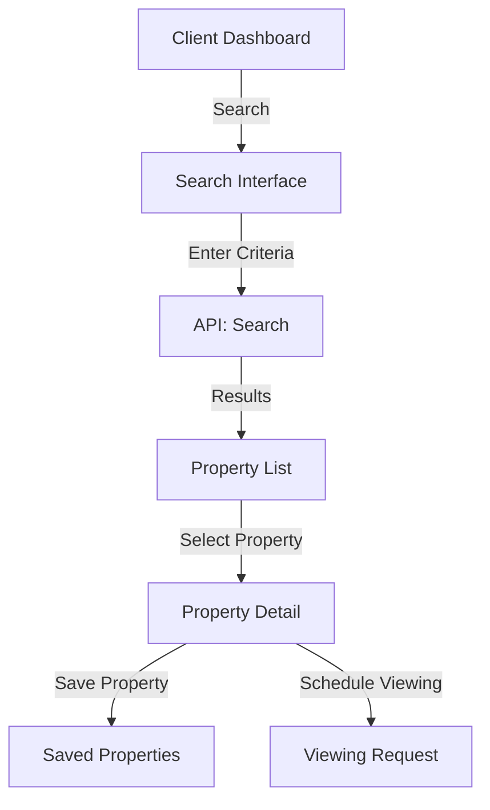
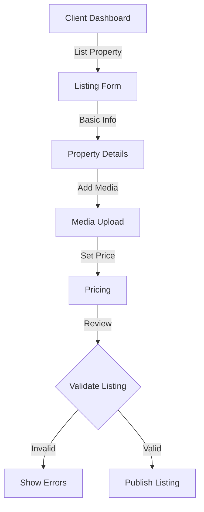
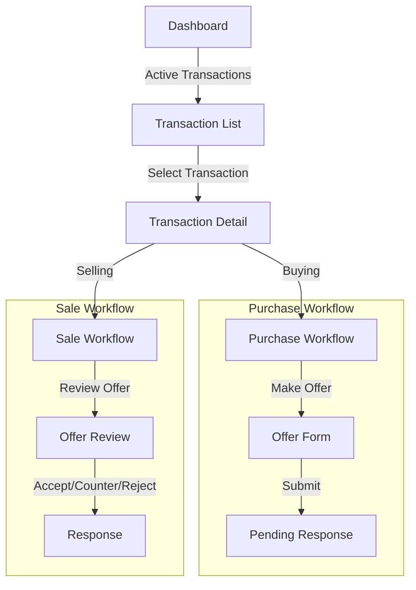
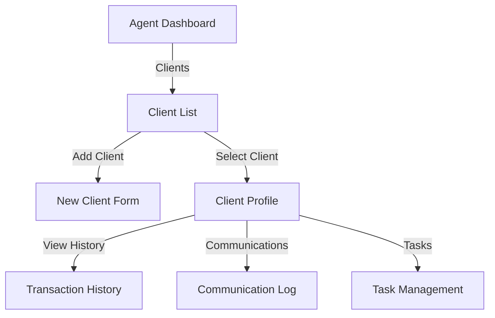
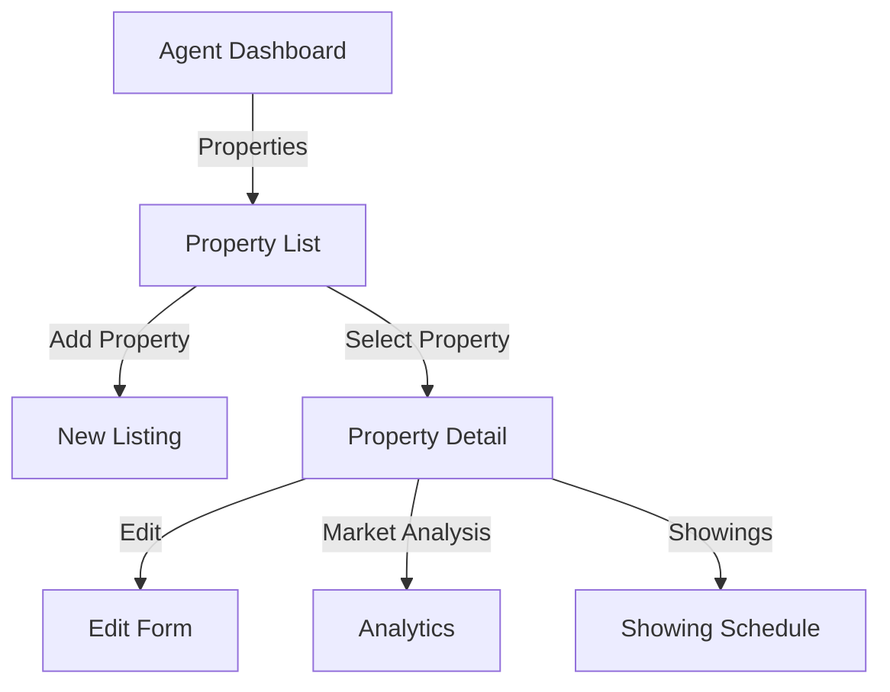

# Assiduous Realty - Workflow Documentation

## System Overview

This document outlines the complete technical and business workflows for all user paths and modal interactions in the Assiduous Realty platform.

## User Roles

### Client Role (Unified)
- Combined buyer and seller capabilities
- Seamless role switching
- Unified dashboard interface

### Agent Role
- Property management
- Client relationship management
- Transaction oversight

## Authentication Flows

### 1. Sign Up Flow


### 2. Login Flow


## Client Portal Workflows

### 1. Property Search Flow


### 2. Property Listing Flow


### 3. Transaction Management Flow


## Agent Portal Workflows

### 1. Client Management Flow


### 2. Property Management Flow


## Technical Implementation Details

### 1. Authentication System
```javascript
// Authentication Flow
const authFlow = {
    signup: async (userData) => {
        // 1. Validate input
        validateUserData(userData);
        
        // 2. Make API request
        const response = await AuthService.signup(userData);
        
        // 3. Handle response
        if (response.success) {
            showSuccess('Account created');
            redirectToLogin();
        } else {
            showError(response.error);
        }
    },
    
    login: async (credentials) => {
        // 1. Validate credentials
        validateCredentials(credentials);
        
        // 2. Authenticate
        const response = await AuthService.login(credentials);
        
        // 3. Handle session
        if (response.success) {
            setAuthToken(response.token);
            redirectToDashboard(response.user.role);
        }
    }
};
```

### 2. Client Portal Implementation
```javascript
// Client Dashboard Initialization
const clientDashboard = {
    initialize: async () => {
        // 1. Load user profile
        const profile = await CRMService.getProfile();
        
        // 2. Load notifications
        const notifications = await CRMService.getNotifications();
        
        // 3. Initialize components
        initializePropertySearch();
        initializeTransactionManager();
        initializeMarketInsights();
    },
    
    initializePropertySearch: () => {
        // Setup search parameters
        // Initialize filters
        // Setup results display
    },
    
    initializeTransactionManager: () => {
        // Load active transactions
        // Setup status updates
        // Initialize document manager
    }
};
```

### 3. Agent Portal Implementation
```javascript
// Agent Dashboard Implementation
const agentDashboard = {
    initialize: async () => {
        // 1. Load agent profile
        const profile = await CRMService.getProfile();
        
        // 2. Load client list
        const clients = await CRMService.getClients();
        
        // 3. Initialize components
        initializeClientManager();
        initializePropertyManager();
        initializeCalendar();
    },
    
    initializeClientManager: () => {
        // Setup client list
        // Initialize communication tools
        // Setup task management
    }
};
```

## State Management

### 1. Authentication State
```javascript
const authState = {
    token: null,
    user: null,
    role: null,
    
    setAuth: (token, user) => {
        authState.token = token;
        authState.user = user;
        authState.role = user.role;
        localStorage.setItem('auth_token', token);
    },
    
    clearAuth: () => {
        authState.token = null;
        authState.user = null;
        authState.role = null;
        localStorage.removeItem('auth_token');
    }
};
```

### 2. User Preferences
```javascript
const userPreferences = {
    theme: 'light',
    notifications: true,
    searchFilters: {},
    
    updatePreferences: (newPrefs) => {
        Object.assign(userPreferences, newPrefs);
        localStorage.setItem('user_preferences', JSON.stringify(userPreferences));
    }
};
```

## API Integration Points

### 1. Authentication Endpoints
```
POST /api/auth/signup
POST /api/auth/login
POST /api/auth/forgot-password
PUT /api/auth/reset-password
```

### 2. Client Endpoints
```
GET /api/client/profile
GET /api/client/properties
POST /api/client/properties
GET /api/client/transactions
POST /api/client/offers
```

### 3. Agent Endpoints
```
GET /api/agent/profile
GET /api/agent/clients
GET /api/agent/properties
POST /api/agent/listings
GET /api/agent/analytics
```

## Error Handling

### 1. Client-Side Validation
```javascript
const validateForm = {
    email: (email) => EMAIL_REGEX.test(email),
    password: (password) => PASSWORD_RULES.test(password),
    phone: (phone) => PHONE_REGEX.test(phone),
    licenseNumber: (license, state) => LICENSE_RULES[state].test(license)
};
```

### 2. API Error Handling
```javascript
const handleApiError = async (response) => {
    if (!response.ok) {
        const error = await response.json();
        throw new Error(error.message || 'API request failed');
    }
    return response.json();
};
```

## Security Considerations

### 1. Authentication Security
- JWT token management
- Password encryption
- Session handling
- CSRF protection

### 2. Data Security
- Input sanitization
- XSS prevention
- CORS configuration
- Rate limiting

## Testing Workflows

### 1. Authentication Testing
```javascript
describe('Authentication Flow', () => {
    test('Sign Up Process', () => {
        // Test user registration
    });
    
    test('Login Process', () => {
        // Test user authentication
    });
});
```

### 2. Transaction Testing
```javascript
describe('Transaction Flow', () => {
    test('Offer Creation', () => {
        // Test offer submission
    });
    
    test('Offer Response', () => {
        // Test offer handling
    });
});
```

## Monitoring and Analytics

### 1. User Activity Tracking
- Page views
- Feature usage
- Error rates
- Session duration

### 2. Performance Metrics
- API response times
- Page load times
- Resource utilization
- Cache hit rates

## Deployment Considerations

### 1. Frontend Deployment
- Static asset optimization
- CDN configuration
- Cache management
- Version control

### 2. API Deployment
- Load balancing
- Auto-scaling
- Database optimization
- Security patches

## Future Enhancements

### 1. Planned Features
- Virtual property tours
- Smart contract integration
- Advanced analytics
- Mobile applications

### 2. Scalability Planning
- Infrastructure scaling
- Database sharding
- Cache optimization
- API versioning

---

*This documentation is maintained by the Assiduous Development Team and should be updated as workflows evolve.*

Last Updated: August 30, 2025
