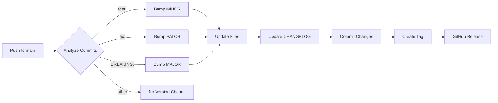

# 🤖 AUTOMATED VERSIONING SYSTEM
## Zero-Touch Version Management

**Status:** ✅ FULLY AUTOMATED  
**Implemented:** September 6, 2025  
**Current Version:** 0.2.0 (will auto-bump to 0.3.0 on next feature)

---

## 🎯 HOW IT WORKS

### You Just Write Code!
The versioning system is **100% automated**. You don't need to:
- ❌ Manually update version numbers
- ❌ Edit CHANGELOG.md
- ❌ Create git tags
- ❌ Make GitHub releases

### What You DO Need:
✅ **Use conventional commit messages**

---

## 📝 COMMIT MESSAGE GUIDE

### Version-Bumping Commits

| Commit Type | Version Bump | Example |
|------------|--------------|---------|
| `feat:` | MINOR (0.X.0) | `feat: Add property search API` |
| `fix:` | PATCH (0.0.X) | `fix: Resolve login timeout` |
| `BREAKING CHANGE:` | MAJOR (X.0.0) | `feat!: Remove deprecated API` |

### Non-Version Commits

| Commit Type | No Version Change | Example |
|------------|------------------|---------|
| `docs:` | Documentation | `docs: Update API guide` |
| `style:` | Code style | `style: Format code` |
| `refactor:` | Code refactoring | `refactor: Simplify auth logic` |
| `test:` | Tests | `test: Add unit tests` |
| `chore:` | Maintenance | `chore: Update dependencies` |
| `ci:` | CI/CD | `ci: Update workflow` |

---

## 🔄 AUTOMATION FLOW



1. **You push** code to main branch
2. **GitHub Actions** analyzes commit messages
3. **Version bumped** based on commit types
4. **Files updated** (VERSION, package.json, README)
5. **CHANGELOG generated** with all changes
6. **Tag created** with release notes
7. **GitHub Release** published automatically

---

## 💡 EXAMPLES

### Example 1: Adding a Feature
```bash
git add .
git commit -m "feat: Add real-time notifications"
git push
# → Version bumps from 0.2.0 to 0.3.0 automatically
```

### Example 2: Fixing a Bug
```bash
git add .
git commit -m "fix: Correct calculation in analytics"
git push
# → Version bumps from 0.3.0 to 0.3.1 automatically
```

### Example 3: Breaking Change
```bash
git add .
git commit -m "feat!: Redesign authentication system

BREAKING CHANGE: Auth tokens now use JWT instead of sessions"
git push
# → Version bumps from 0.3.1 to 1.0.0 automatically
```

### Example 4: Documentation (No Version Change)
```bash
git add .
git commit -m "docs: Update installation guide"
git push
# → No version change, just updates docs
```

---

## 🛠️ MANUAL CONTROLS (If Needed)

### Skip Automation
Add `[skip ci]` to your commit message:
```bash
git commit -m "feat: Add feature [skip ci]"
```

### Skip Version Bump Only
Add `[no version]` to your commit message:
```bash
git commit -m "feat: Add feature [no version]"
```

### Force Manual Version
```bash
# Interactive mode
./scripts/auto-version.sh

# Auto mode with push
./scripts/auto-version.sh --auto --push

# Specific version
./scripts/update-version.sh 1.0.0
```

---

## 📊 VERSION HISTORY TRACKING

### Check Current Version
```bash
cat VERSION
# or
./scripts/check-version.sh
```

### View Version History
```bash
git tag -l | sort -V
```

### View Specific Release
```bash
git show v0.2.0
```

---

## 🔍 WHAT GETS UPDATED

When version is bumped, these files are automatically updated:

1. **VERSION** - Single source of truth
2. **package.json** - `"version": "X.Y.Z"`
3. **README.md** - Version badge
4. **CHANGELOG.md** - Release notes with:
   - Date
   - Version number
   - Categorized changes (Added, Fixed, Changed)
   - Links to commits
   - Comparison links

---

## 🚨 TROUBLESHOOTING

### Version Didn't Bump
**Cause:** No feat/fix commits since last tag  
**Solution:** Check commit types with `git log --oneline`

### Wrong Version Bump
**Cause:** Incorrect commit type used  
**Solution:** Use `feat:` for features, `fix:` for bugs

### Need to Revert Version
```bash
git tag -d v0.3.0              # Delete local tag
git push origin :refs/tags/v0.3.0  # Delete remote tag
./scripts/update-version.sh 0.2.0  # Reset version
```

### Check Automation Status
Go to GitHub → Actions tab → Check workflow runs

---

## 📈 BENEFITS

1. **Zero Manual Work** - Never touch version files again
2. **Consistent Versioning** - Follows SemVer automatically
3. **Automatic CHANGELOG** - Always up-to-date release notes
4. **GitHub Releases** - Professional releases every time
5. **Clear History** - Version tied to actual changes
6. **Team Friendly** - Everyone follows same system

---

## 🎯 BEST PRACTICES

1. **Write Clear Commits** - They become your changelog
2. **Use Correct Types** - feat/fix/docs/etc.
3. **One Feature Per Commit** - Makes history cleaner
4. **Test Before Pushing** - Automation runs on push
5. **Review Actions Tab** - Monitor automation health

---

## 📝 QUICK REFERENCE

```bash
# Feature (bumps minor: 0.X.0)
git commit -m "feat: Add new dashboard widget"

# Bug fix (bumps patch: 0.0.X)
git commit -m "fix: Resolve memory leak"

# Breaking (bumps major: X.0.0)
git commit -m "feat!: Restructure API endpoints"

# Docs (no bump)
git commit -m "docs: Update README"

# Skip automation
git commit -m "feat: Add feature [skip ci]"
```

---

**Remember:** Just write good commit messages and push. The system handles everything else! 🚀
